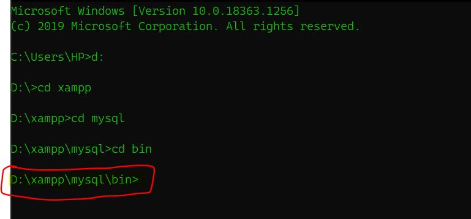
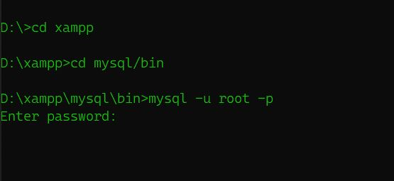
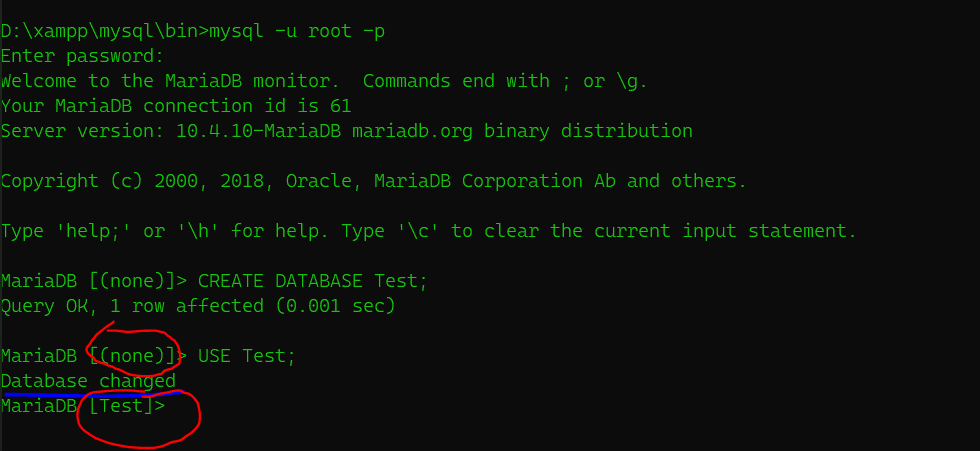

# Basic Queries of SQL 
So, After completion of Installtion we are going to get our hands dirty with some basic commands of SQL from now on. As i told u in earlier section we will stick with cmd(terminal) rather than from using GUI(Graphical User Interface).

In this article we are going to create the Database name Test and select that Database and again delete that Database

So, first of all we are opening CMD and change the to the directory where we installed our XAMPP\
**In My case its D:xampp (Your case may be different)**

* So I change by drive and change the diectory to xampp with commands
     - d: (Changing the drive from C to D)
     - cd xampp (changing the directory '/' to '/xampp'. )

* After going to the xampp flder we will go the mysql directory and then bin directory.
  ### we can do that with commands 
      - cd mysql
      - cd bin
* Your path must be like this xampp/mysql/bin
  
  
* After that we have to login to the MySQL. So you may wonder what may be your username and password.Its same for all by defaut. Since we have not changed anything 
  the username is root and password is nothing 
  just a empty string

  - ### So to login, command is
    - mysql -u root -p 

* After that command you will be asked for the password but you just have to press enter and welcome message is show on the screen 

* If you got that message you have successfully logged into MySQL. But if you haven't got that message you have done some error check this article from begginnig or you can also found many videos on youtube. you can watch any one of them

* ### After login we almost setup everything. Now we just have to go for our goals
    - Create a Database named Test (For Testing)
    - Use data Database 
    - Delete that DataBase

* So first of all we are going to create a new Database. You may think it may be to tough to create database but it is much more easier than it sounds.
    * You just have to give command 
        - CREATE DATABASE Test;
  

Congrats! you have created your first Database

* Now lets go for our second goal that is using that Database
 
 ### command for using our Test DataBase
    - USE Test;

 *yoho! You have selected your newly created database*

 ### Now our final goal that is deleting our Test Databse
    - DROP DATABASE Test;

Great! you have completed our all three goals. 

# Notes from Section 2
    - To Create Database our command is 
      - CREATE DATABASE {DATABASE_NAME}
    - To Use DataBase 
      - USE {DATABASE_NAME}
    - To Drop (Delete) DataBase 
      - DROP DATABASE {DATABASE_NAME}
    - All the DATABASE name are case sensitive. You must give proper and unique name for each and every database.

  # Alright now its your turn to do some stuff on your own.
Go and make your hands dirty with some basic SQL Statements. Do it youself and analyze yourself if you have any problem you can revise through this article.
 - ## [Exercise](./exercise.md) 
  

 
  

