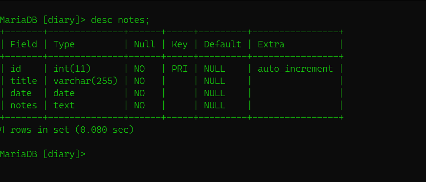

# Primary Keys
    - A primary key is a column, or set of columns, which uniquely identifies a record within a table
    - Primary key must be unique 
    - Primary key cannot be NULL
    - A table can have and must have one primary key

## **Example**

In the above table structure, we can see that i have given a primary key to the id.Since, we can create multiple notes on a same date with same title and in some cases may be the notes can be same. As Primary key must be unique id is the perfect field for being the primary key as it auto increment after insertion of any data and 
we can access the data(tuples) with its unique id.

---
But this is just a thoery part we are going to learn more on this topic when we actually deal with the tables.

---

# Foreign Keys
In some cases we have to store a lot of attributes of Entity.
If we kept all the attributes in a same table then the table will be mess in complex. Foreign key plays great role here.

-  A foreign key is used to link two tables together       
- A foreign key is a column whose values match the   values of another tables primary key column.
- The table with the primary key is called the refrence, or parent table and the table with foreign key is called child table.
-  A table can have multiple foreign keys
