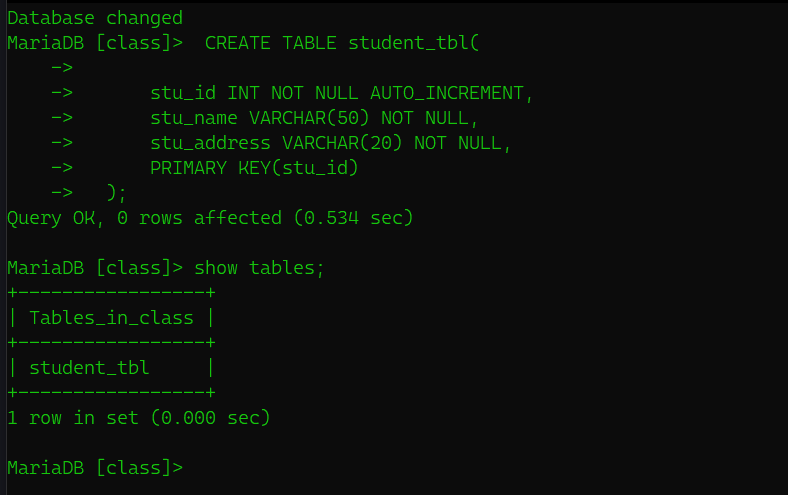
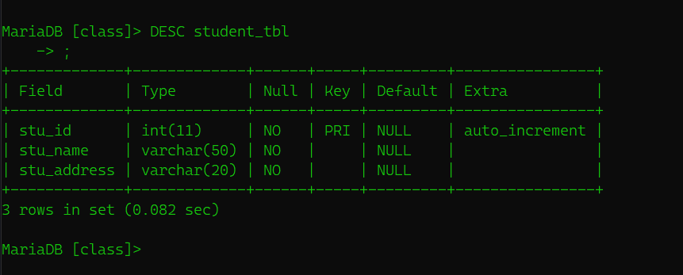
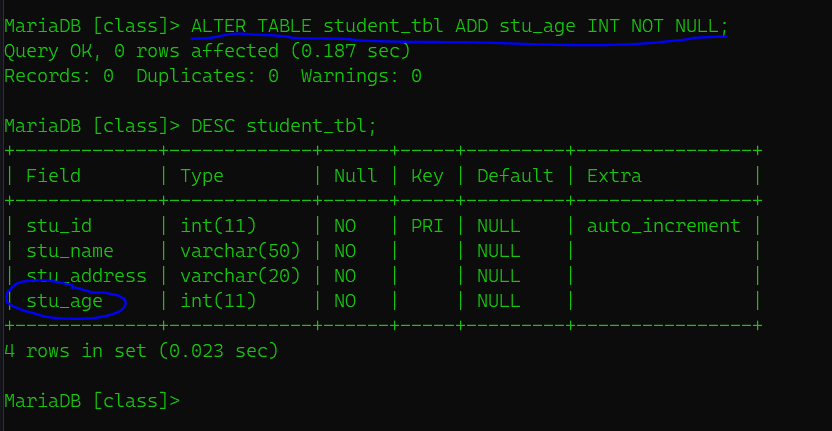
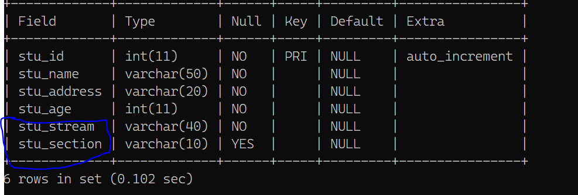
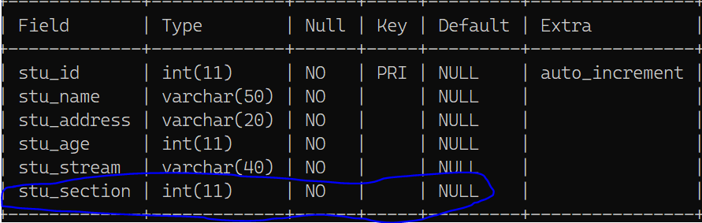
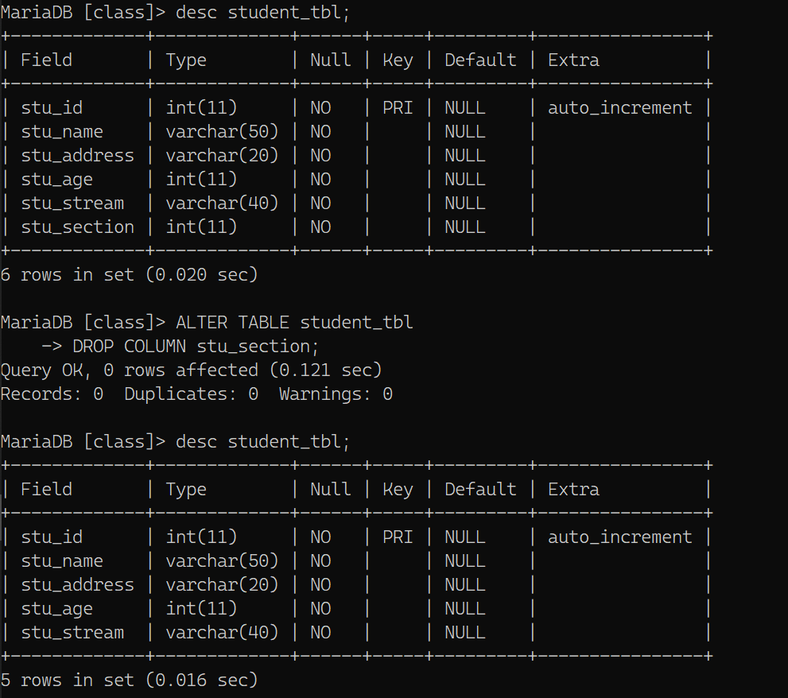

# Tables
---
So in this article we are going to do some SQL statement related with tables like Creating, 
Atler table, Truncate and Drop Tables. Since MySQL is the Relational Database Management System. We have to deal with tables in all the over this course. 

## Creating Table
To create the Table into the database Create table command(statement is used). A table creaton requires three things:

    -  Name of the Table 
    -  Name of fields
    -  Defination of each fields

 Synatx

---
Following is the generic Syntax for creating a table in MySQL database.

    - CREATE TABLE {Table_name}(column_name column_type......);
## Example 
  Here we will create a table name `student_tbl` in database `class`. So Its your work to create and use the database name `class`.
  After creating and using the database `class` now we can give Statement to create command
  

  CREATE TABLE student_tbl(

      stu_id INT NOT NULL AUTO_INCREMENT,
      stu_name VARCHAR(50) NOT NULL,
      stu_address VARCHAR(20) NOT NULL,
      PRIMARY KEY(stu_id)
  );
  

  ### Note
    - Here, NOT NULL is a field attribut and it is used because we don't want this field to be NULL. If you try to create a record with NULL value then MySQL will raise an error
    - The field attribute AUTO_INCREMENT specifies MySQL to go ahead and add the next available number to the id field. PRIMARY KEY is used to define a column as a primary key. You can use multiple columns seperated by comma to define a primary key.
---
## Output 

After you run the above statment you have created table named `student_tbl` in database named `class`. You can see that using command 
    
    - SHOW TABLES;

and you can see

You can also see the structure of the table with command 

DESC {TABLE_NAME} => describe table 

    - DESC student_tbl;

- You can clearly see that stuid is a primary key of data type INT

- stu_name and stu_address is of type varchar of length 50 and 20 respectively

---
## ALTER TABLE
---
We are humans and we do lots of mistakes in our day to day life. We may also do some mistakes while creating table structure. then what do we do then ?

- Drop that table and create a whole new table with correct form?

    - NO, if we do so then we will lose all our previous data and had to rewrite/recover it again. So, the solution is ALTER STATEMENT. ALTER statement is used with `ADD`, `DROP` and `MODIFY` commands according to the situations.
  
## ADD a column in existing table

    Syntax:

    ALTER TABLE {Table_name}

    ADD {new_column_name} {column_defination}

    [FIRST|AFTER {column_name}];

### Parameters

    - Table_name : It specifies the name of the table that you wants to modify.

    - new_column_name: It specifies the name of the new column(field) that you want to add to the table.

    - column_defination: It specifies the data type and the defination of the column(NULL or NOT NULL etc)

    - FIRST | AFTER column_name : It is optional.It tells MySQL where to create the column in the table.If this parameter is not specified, the new column will be added to the end of the table.
  
### Example
In this Example we are going to add student age in the table column.So i am going to keep the field name `stu_age`

 

  ALTER TABLE student_tbl ADD stu_age INT NOT NULL;
  

### OUTPUT
And to see the table structure you know what to do.(You havae done that earlier).

## Add Multiple Column
    
    Syntax
        ALTER TABLE {Table_name}
        ADD {new_column_name} {column_defination}
        [FIRST|AFTER column name],
        ADD {new_column_name} {column_defination}
        [FIRST|AFTER column name].
        ....;

## Example 

In tis example, we are going to add two new columns `stu_stream` and `stu_section` in the existing table `student_tbl`

    - ALTER TABLE student_tbl
    - ADD stu_stream VARCHAR(40) NOT NULL,
    - AFTER stu_address,
    - ADD stu_section VARCHAR(10)
    - ;

### Output
You can see two column has been added in the table.

# MODIFY column in the table
 sometimes we have to modify the column data type.The modify command is used to change column defination of table

    - SYNTAX
  ALTER TABLE {Table_name} 
  MODIFY {column_name} {column_defination} 
  [FIRST|AFTER column_name];

  # Example 
  For just an example lets modify the the defination of stu_section from varchar to INT NOT NULL.

  For that your command should be 
  
    - ALTER TABLE student_tbl
    - MODIFY stu_section INT NOT NULL;

  # Output
  

  # DROP column in table
  We can also drop the column from the table and for that syntax is
    
    - ALTER TABLE {TABLE_NAME}
    - DROP COLUMN {Column_name};
 ## Example
 Lets drop the column `stu_section` that we modified earlier and for that our query is

    - ALTER TABLE student_tbl
    - DROP COLUMN stu_section;

 ## Output

 you can see the difference between the upper table structure and lower structure

 

 # Rename column in table
 We can also rename the column as per needs 

    
    

